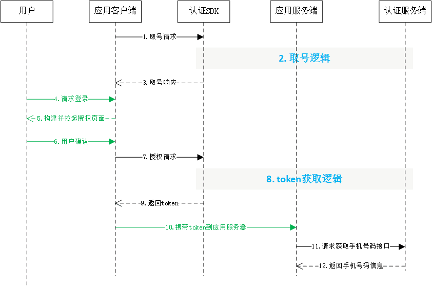

# 1. 接入指南
sdk技术问题沟通QQ群：609994083</br>

**注意事项：**

1. 认证取号服务必须打开蜂窝数据流量并且手机操作系统给予应用蜂窝数据权限才能使用
2. 取号请求过程需要消耗用户少量数据流量（国外漫游时可能会产生额外的费用）
3. 认证取号服务目前支持中国移动2/3/4G和中国电信4G
4. 关于iPhoneXS Max以及iPhoneXR双卡的适配问题：
   1. 当两张卡的运营商不一致时，SDK会获取设备上网卡的运营商并进行取号，但上网卡不一定会获取成功（飞行模式状态时），若获取失败，SDK将默认取号卡为移动运营商取号，如果匹配，则取号成功，否则SDK返回103111；
   2. 当SDK存在缓存并且两张卡的运营商不相同时，SDK会重新获取上网卡运营商与上一次取号的运营商进行对比，若两次运营商不一致，则以最新设置的上网卡的运营商为准，重新取号，上次获取的缓存将自动失效；双卡运营商相同的情况则不需要重新取号。

## 1.1. 接入流程

**1.申请appid和appkey**

根据《开发者接入流程文档》，前往中国移动开发者社区（dev.10086.cn)，按照文档要求创建开发者账号并申请appid和appkey，并填写应用的包名（bundle ID)。

**2.申请能力**

应用创建完成后，在能力配置页面上，勾选应用需要接入的能力类型，如一键登录，并配置应用的服务器出口IP地址。（如果在服务端需要用非对称加密方法对一些重要信息进行加密处理，请在能力配置页面填写RSA加密的公钥）

**3.添加appid白名单**

开发者在完成步骤1和步骤2后，将appid提供给移动认证工作人员，移动方将在2个工作日内将appid加入白名单，白名单添加完毕，开发者就可以开始联调对接。

**4.上线审核**

应用上线前，开发者需要将一键登录取号能力的场景所使用的授权页面（授权页面参考授权页面规范）提供给移动认证产品接口人，审核无误后可正式上线。

## 1.2. 开发流程

**第一步：下载SDK及相关文档**

请在开发者群或官网下载最新的SDK包

**第二步：搭建开发环境**

1. xcode版本需使用9.0以上，否则会报错
2. 导入认证SDK的framework，直接将移动认证`TYRZSDK.framework`拖到项目中
3. 在Xcode中找到`TARGETS-->Build Setting-->Linking-->Other Linker Flags`在这选项中需要添加`-ObjC`


**第三步：开始使用移动认证SDK**

**[1] 初始化SDK**

在需要进行登录操作的场景进行以下的初始化调用。

```objective-c
[UASDKLogin.shareLogin registerAppId:APPID AppKey:APPKEY];
```

**方法原型：**

```objective-c
- (void)registerAppId:(NSString *)appId AppKey:(NSString *)appKey;
```

**参数说明：**

| 参数   | 类型     | 说明        |
| ------ | -------- | ----------- |
| appID  | NSString | 应用的appid |
| appKey | NSString | 应用密钥    |

<div STYLE="page-break-after: always;"></div>

**[2] 设置SDK取号以及授权获取token的超时时间（不设置默认8s）**

调用以下方法设置超时（**注：超时时间单位是毫秒**）

```objective-c
[UASDKLogin.shareLogin setTimeoutInterval:10000.f];
```

**方法原型：**

```objective-c
- (void)setTimeoutInterval:(NSTimeInterval)timeoutInterval;
```

**参数说明：**

| 参数   | 类型     | 说明        |
| ------ | -------- | ----------- |
| timeoutInterval | NSTimeInterval | 若小于等于0则默认为8000ms |

<div STYLE="page-break-after: always;"></div>

# 2. 一键登录功能

## 2.1. 准备工作

在中国移动开发者社区进行以下操作：

1. 获得appid和appkey、APPSecret（服务端）；
2. 勾选一键登录能力；
3. 配置应用服务器的出口ip地址
4. 配置公钥（如果使用RSA加密方式）
5. **针对本机号码校验：**勾选本机号码校验短验辅助开关（可选）
6. **针对本机号码校验：**商务对接签约（未签约应用每个appid每天只能调用1000次）

## 2.2. 流程说明 

1. 应用发起取号请求，成功后，应用将得到手机号掩码，SDK将缓存取号临时凭证scrip。
2. 开发者按照要求（详见：**2.4章节**）构建授权页面。
3. 用户授权同意后，应用发起授权请求，成功后，应用将得到换号凭证token。
4. 携带token请求获取手机号码接口，获取用户的手机号码信息。



## 2.3. 取号请求

本方法用于发起取号请求，SDK完成网络判断、蜂窝数据网络切换等操作并缓存凭证scrip。

**请求示例代码**

```objective-c
[UASDKLogin.shareLogin getPhoneNumberCompletion:^(NSDictionary * _Nonnull sender) {
    NSLog(@"result = %@", sender);
}];
```

**取号方法原型：**

```objective-c
- (void)getPhoneNumberCompletion:(void (^)(NSDictionary * sender))completion;
```

**参数说明：**

| 参数       | 类型           | 说明                                         |
| ---------- | -------------- | -------------------------------------------- |
| completion | Block          | 取号回调                                     |

**返回说明：**

| 参数          | 类型     | 说明                          |
| ------------- | -------- | ----------------------------- |
| resultCode    | NSString | 返回相应的结果码              |
| desc          | NSString | 调用描述                      |
| securityPhone | NSString | 手机号码掩码，如“138XXXX0000” |
| operatorType  | NSString | 运营商，如“中国移动”  |


## 2.4. 创建授权页

为了确保用户在登录过程中将手机号码信息授权给开发者使用的知情权，一键登录需要开发者提供授权页登录页面供用户授权确认。开发者在调用授权登录方法前，必须弹出授权页，明确告知用户当前操作会将用户的本机号码信息传递给应用。授权页面的设计、布局、生成、弹出和消失，由开发者自行处理，但必须遵守移动认证授权页面设计规范。

注1：如果开发者需要使用**一键登录**服务，必须按照规定创建授权页面

注2：**本机号码校验**不需要创建授权页面，可以直接跳过2.4章

### 2.4.1. 页面规范细则

1、页面必须包含登录/注册按钮，授权登录方法必须绑定该按钮使用。

2、登录按钮文字描述必须包含“登录”或“注册”等文字，不得诱导用户授权。

3、页面需要提示应用获取到的是用户的本机号码，例如，可以在页面显示本机号码的掩码（139xxxx0000），或者提示用户将使用“本机号码”作为账号登录或注册。

4、页面必须包含移动认证协议条款，其中：

​	条款名称：《中国移动认证服务条款》

​	条款页面地址：https://wap.cmpassport.com/resources/html/contract.html

5、应用在上线前需将满足上述1~4的授权页面（正式上线版的）截图提供给产品接口人审核。

6、应用后续升级时，如果授权页面有较大改动（针对1~4内容进行修改），需将改动的授权页面截图提供给产品接口人审核。

7、对于未遵照1~4设计要求，或通过技术手段故意屏蔽不弹出授权页面但获得调用接口凭证token的行为，能力提供方有权限制APP一键登录取号能力的使用，待整改后再恢复提供服务。

### 2.4.2. 构建授权页控制器

授权登录页面由开发者按照规范设计和构建

1.开发者创建自定义子类CustomAuthViewController，并在该子类中布局UI控件

```objective-c
// CustomAuthViewController.h
@interface CustomAuthViewController : UIViewController

@end

// CustomAuthViewController.m
@implementation CustomAuthViewController

-(void)setupUI{
    
}

@end
```

2.客户端在需要拉起授权页的场景初始化授权页控制器动作

```objective-c
//初始化CustomAuthViewController类（即登录授权页）实例控制器，弹出这个授权页面。
CustomAuthViewController *authVC = [[CustomAuthViewController alloc]init];
[self presentViewController:authVC animated:YES completion:nil];
```

## 2.5. 授权请求

用户调用授权方法，获取取号token

**请求示例代码：**

```objective-c
//1.构建授权页控制器

//2.调用取号方法（根据实际需求，也可以放在构建授权页控制前调用）
-(void)getPhonenumber{
    
    [UASDKLogin.shareLogin getPhoneNumberCompletion:^(NSDictionary * _Nonnull sender){
        if ([sender[@"resultCode"] isEqualToString:@"103000"]) {
            NSLog(@"取号成功:%@",sender);
            // 显示手机号码掩码
            self.securityPhoneLable.text = sender[@"securityPhone"];
        } else {
            NSLog(@"取号失败:%@",sender);
            [self dismissViewControllerAnimated:YES completion:nil];
        }
    }];
}

//3.授权登录按钮点击事件，调用授权方法
-(void)authorizeLoginButtonClick{
    
    [UASDKLogin.shareLogin getAuthorizationCompletion:^(NSDictionary * _Nonnull sender) {
        if ([sender[@"resultCode"] isEqualToString:@"103000"]) {
            NSLog(@"授权登录成功:%@",sender);
        } else {
            NSLog(@"授权登录失败:%@",sender);
        }
        [self dismissViewControllerAnimated:YES completion:nil];
    }];
}

//@end
```

**授权方法原型：**

```objective-c
- (void)getAuthorizationCompletion:(void (^)(NSDictionary *sender))completion;
```

**参数说明：**

**请求参数**

| 参数     | 类型                 | 说明                                                         |
| -------- | -------------------- | ------------------------------------------------------------ |
| completion | Block                | 登录回调                                                     |

**响应参数**

| 参数       | 类型     | 说明                                                         |
| ---------- | -------- | ------------------------------------------------------------ |
| resultCode | NSString | 返回相应的结果码                                             |
| token      | NSString | 成功时返回：临时凭证，token有效期2min，一次有效，同一用户（手机号）10分钟内获取token且未使用的数量不超过30个 |
| openId     | NSString | 成功时返回：用户身份唯一标识 |
| desc       | NSString | 返回描述                                                     |

## 2.6. 获取手机号码（服务端）

详细请开发者查看移动认证服务端接口文档说明。


## 2.7. 本机号码校验（服务端）

详细请开发者查看移动认证服务端接口文档说明。

# 3. SDK方法说明

## 3.1. 初始化

用于初始化appId、appKey设置。

**原型**

```objective-c
- (void)registerAppId:(NSString *)appId appKey:(NSString *)appKey;
```

</br>

**请求参数**

| 参数   | 类型     | 说明        |
| ------ | -------- | ----------- |
| appID  | NSString | 应用的appid |
| appKey | NSString | 应用密钥    |

**响应参数**

无

## 3.2. 取号请求

本方法用于发起取号请求，SDK完成网络判断、蜂窝数据网络切换等操作并缓存凭证scrip。

**原型**

```objective-c
- (void)getPhoneNumberCompletion:
		(void (^)(NSDictionary * sender))completion;
```

**请求参数**

| 参数       | 类型           | 说明                                       |
| ---------- | -------------- | ------------------------------------------ |
| completion | Block          | 取号回调 |

**响应参数**

| 参数          | 类型     | 说明                          |
| ------------- | -------- | ----------------------------- |
| resultCode    | NSString | 返回相应的结果码              |
| desc          | NSString | 调用描述                      |
| securityPhone | NSString | 手机号码掩码，如“138XXXX0000” |
| operatorType  | NSString | 运营商，如“中国移动”  |

**请求示例代码**

```objective-c
 [UASDKLogin.shareLogin getPhoneNumberCompletion: ^ (NSDictionary * _Nonnull sender) {
        if ([sender[@ "resultCode"] isEqualToString: @"103000"]) {
            NSLog(@ "取号成功:%@", sender);
        } else {
            NSLog(@ "取号失败:%@", sender);
        }
    }];
```

**响应示例代码**

```
{
    "resultCode" : "103000",
    "desc" : "success",
    "securityPhone" : "138XXXX0000",
    "operatorType" : "中国移动",
}
```

## 3.3. 授权请求

SDK的一键登录接口，获取到的token可以在移动认证服务端获取完整手机号

**原型**

```objective-c
- (void)getAuthorizationCompletion:
		(void (^)(NSDictionary *sender))completion;
```

**请求参数**

| 参数     | 类型                 | 说明                                                         |
| -------- | -------------------- | ------------------------------------------------------------ |
| completion | Block                | 登录回调                                                     |

**响应参数**

| 参数       | 类型     | 说明                                                         | 是否必填   |
| ---------- | -------- | ------------------------------------------------------------ | ---------- |
| resultCode | NSString | 返回相应的结果码                                             | 是         |
| token      | NSString | 成功时返回：临时凭证，token有效期2min，一次有效，同一用户（手机号）10分钟内获取token且未使用的数量不超过30个 | 成功时必填 |
| openId     | NSString | 成功时返回：用户身份唯一标识 | 成功时必填 |
| desc       | NSString | 调用描述                                                     | 否         |

**完整一键登录调用示例**

```objective-c
//1.构建授权页控制器

//2.调用取号方法（根据实际需求，也可以放在构建授权页控制前调用）
-(void)getPhonenumber{
    __weak typeof(self) weakSelf = self;
    [UASDKLogin.shareLogin getPhoneNumberCompletion:^(NSDictionary * _Nonnull sender){
        if ([sender[@"resultCode"] isEqualToString:@"103000"]) {
            NSLog(@"取号成功:%@",sender);
            // 显示手机号码掩码
            weakSelf.securityPhoneLable.text = sender[@"securityphone"];
        } else {
            NSLog(@"取号失败:%@",sender);
            [weakSelf dismissViewControllerAnimated:YES completion:nil];
        }
    }];
}

//3.授权登录按钮点击事件，调用授权方法
-(void)authorizeLoginButtonClick{
    __weak typeof(self) weakSelf = self;
    [UASDKLogin.shareLogin getAuthorizationCompletion:^(NSDictionary * _Nonnull sender) {
        if ([sender[@"resultCode"] isEqualToString:@"103000"]) {
            NSLog(@"授权登录成功:%@",sender);
        } else {
            NSLog(@"授权登录失败:%@",sender);
        }
        [weakSelf dismissViewControllerAnimated:YES completion:nil];
    }];
}

//@end
```

**响应示例代码**

```
{
    "openId" = "003JI1Jg1rmApSg6yG0ydUgLWZ4Bnx0rb4wtWLtyDRc0WAWoAUmE";
    "resultCode" = "103000";
    "desc" = ""
    "token" = "STsid0000001517196594066OHmZvPMBwn2MkFxwvWkV12JixwuZuyDU";
}
```

## 3.4. 本机号码校验

###3.4.1. 方法描述

**功能：**
该方法用于获取**本机号码校验校验token**，且该接口只能用于校验移动的手机号码，其它运营商一律返回**200080**返回码，并提示**本机号码校验仅支持移动号码**

**原型：**

```objective-c
- (void)mobileAuthCompletion:(void (^)(NSDictionary *sender))completion;
```

###3.4.2. 参数说明

**请求参数**

| 参数     | 类型   | 说明  |
| :-:     | :-:    | :-: |
| completion | Block  | 请求回调  |

**响应参数**

| 参数 | 类型 | 说明 |
| :-: | :-: | :-: |
| resultCode | NSString | 返回码 |
| desc | NSString | 描述 |
| token | NSString | 本机号码校验token |


## 3.5. 获取网络状态和运营商类型

本方法用于获取用户当前上网卡的网络环境和运营商

**原型：**

```objective-c
@property (nonatomic,readonly) NSDictionary<NSString *, NSNumber *> *networkType;
```

**响应参数**

| 参数        | 类型     | 说明                                                   |
| ----------- | -------- | ------------------------------------------------------ |
| networkType | NSNumber | 0.无网络;</br>1.数据流量;</br>2.wifi;</br>3.数据+wifi  |
| carrier     | NSNumber | 0.获取不到运营商时，该值代表移动;</br>1.中国移动;</br>2.中国联通;</br>3.中国电信 |

## 3.6. 删除临时取号凭证

本方法用于删除取号方法`getPhoneNumberCompletion`成功后返回的取号凭证scrip

**原型**

```objective-c
- (BOOL)delectScrip;
```

**响应参数**

| 参数  | 类型 | 说明                                          |
| ----- | ---- | --------------------------------------------- |
| state | BOOL | 删除结果状态，（YES：有缓存，已执行删除，NO：无缓存，不执行删除） |

<div STYLE="page-break-after: always;"></div>

# 4. 返回码说明

## 4.1. SDK返回码

使用SDK时，SDK会在认证结束后将结果回调给开发者，其中结果为JSONObject对象，其中resultCode为结果响应码，103000代表成功，其他为失败。成功时在根据token字段取出身份标识。失败时根据resultCode定位失败原因。

| 错误编号      | 返回码描述                       |
| ------------- | ------------------------------|
| 103000        | 成功                           |
| 200022        | 无网络                         |
| 200023        | 请求超时                       |
| 200025        | 未知错误，一般配合描述分析        |                
| 200027        | 未开启数据网络或蜂窝不稳定        |                    
| 200038        | 非移动网关重定向失败             |
| 200048        | 用户未安装sim卡                |
| 200050        | Socket创建失败或发送接收数据错误   |
| 200064        | 异常数据                    |
| 200072       |CA根证书认证失败         |
| 200080       |本机号码校验仅支持移动号码 |
